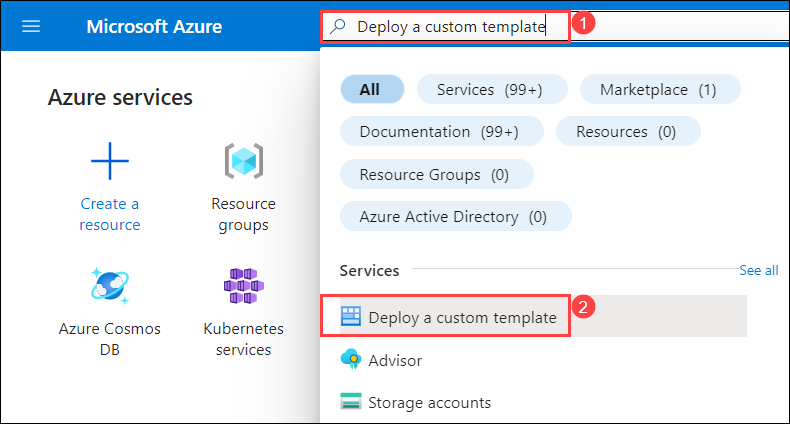
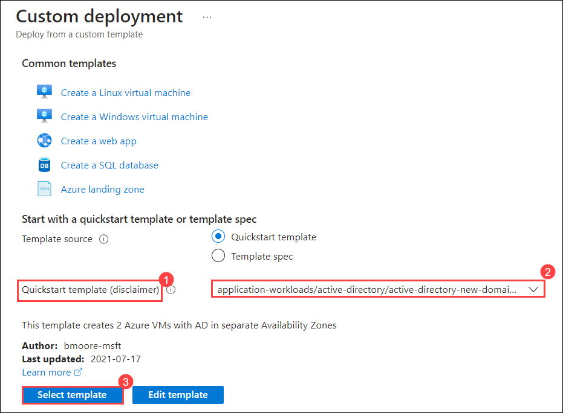
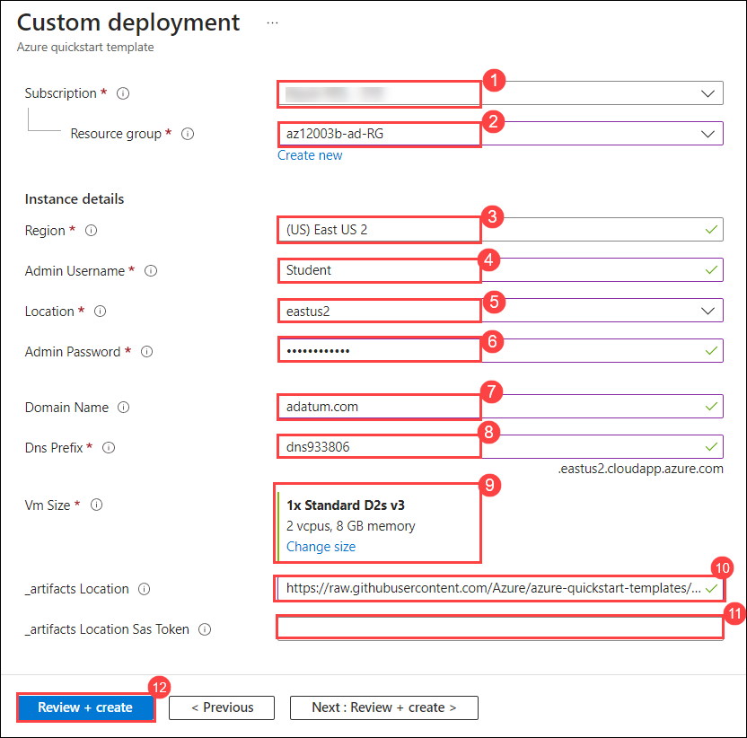
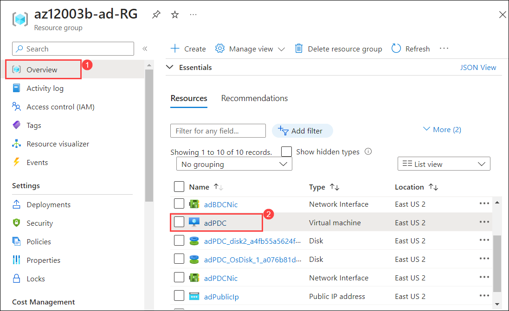
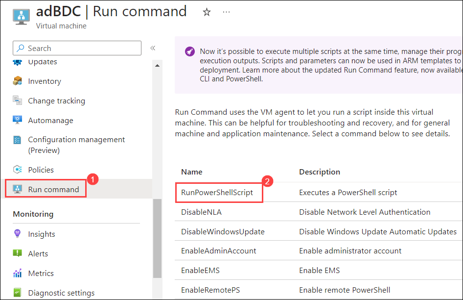
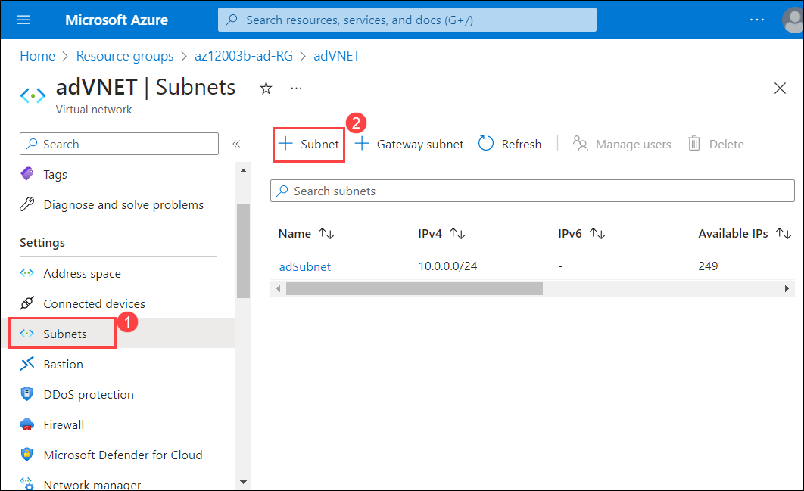
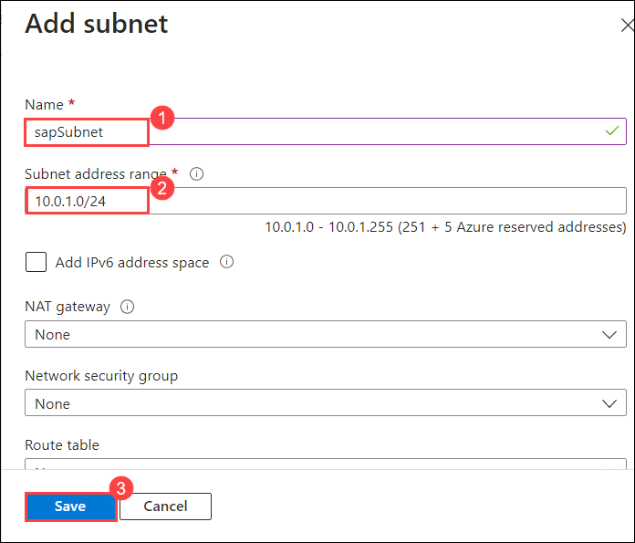
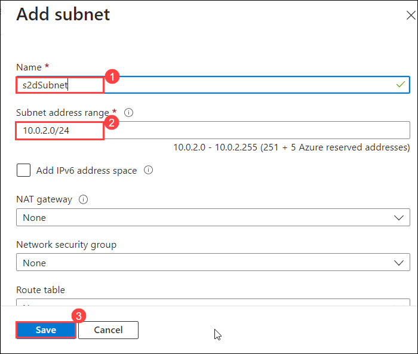

# AZ 120 Module 4: Deploy SAP on Azure
# Lab 4b: Implement SAP architecture on Azure VMs running Windows

Estimated Time: 150 minutes

All tasks in this lab are performed from the Azure portal (including a PowerShell Cloud Shell session)  

   > **Note**: When not using Cloud Shell, the lab virtual machine must have Az PowerShell module installed [**https://docs.microsoft.com/en-us/powershell/azure/install-az-ps-msi**](https://docs.microsoft.com/en-us/powershell/azure/install-az-ps-msi).

Lab files: none

## Scenario
  
In preparation for deployment of SAP NetWeaver on Azure, Adatum Corporation wants to implement a demo that will illustrate highly available implementation of SAP NetWeaver on Azure VMs running Windows Server 2016.

## Objectives
  
After completing this lab, you will be able to:

-   Provision Azure resources necessary to support a highly available SAP NetWeaver deployment

-   Configure operating system of Azure VMs running Windows to support a highly available SAP NetWeaver deployment

-   Configure clustering on Azure VMs running Windows to support a highly available SAP NetWeaver deployment

## Requirements

-   A Microsoft Azure subscription with the sufficient number of available Dsv3 vCPUs (four Standard_D2s_v3 VM with 2 vCPU and six Standard_D4s_v3 VMs with 4 vCPUs each) in an Azure region that supports availability zones

-   A lab computer with an Azure Cloud Shell-compatible web browser and access to Azure


## Exercise 1: Provision Azure resources necessary to support highly available SAP NetWeaver deployments

Duration: 60 minutes

In this exercise, you will deploy Azure infrastructure compute components necessary to configure Windows clustering. This will involve creating a pair of Azure VMs running Windows Server 2016 in the same availability set.

### Task 1: Deploy a pair of Azure VMs running highly available Active Directory domain controllers by using an Azure Resource Manager template

1.  Type **Deploy a custom template (1)** in the search box of the Azure portal menu, and select it **(2)**.

     

1.  From the **Custom deployment** blade, scroll down to **Quickstart template (disclaimer) (1)** and select the **application-workloads/active-directory/active-directory-new-domain-ha-2-dc-zones (2)**, from the drop-down list then click **Select template (3)**.

    

    > **Note**: Alternatively, you can launch the deployment by navigating to Azure Quickstart Templates page at <https://github.com/Azure/azure-quickstart-templates>, locating the template named **Create 2 new Windows VMs, a new AD Forest, Domain and 2 DCs in separate availability zones**, and initiating its deployment by clicking **Deploy to Azure** button.

1.  On the blade **Create a new AD Domain with 2 DCs using Availability Zones**, specify the following settings :

    -   Subscription: Select your **Azure subscription (1)**

    -   Resource group: Choose the resource group **az12003b-ad-RG (2)** form the drop-down list

    -   Location: Choose **<inject key="Region" enableCopy="false"/> (3)**

    -   Admin Username: Enter **Student (4)**

    -   Location:  Choose **<inject key="Region" enableCopy="false"/> (5)**

    -   Password: Enter **Pa55w.rd1234 (6)**

    -   Domain Name: Enter **adatum.com (7)**

    -   DnsPrefix: Enter **dns<inject key="Deployment ID" enableCopy="false"/> (8)**

    -   Vm Size: **Standard D2s_v3 (9)**

    -   _artifacts Location: Enter **https://raw.githubusercontent.com/Azure/azure-quickstart-templates/master/application-workloads/active-directory/active-directory-new-domain-ha-2-dc-zones/** **(10)**

    -   _artifacts Location Sas Token: Leave it as default **(11)**
    
    - Click on **Review + Create (12)**.
    
    

1. Review the configuration and click on **Create**
    > **Note**: The deployment should take about 35 minutes. Wait for the deployment to complete before you proceed to the next task.

    > **Note**: If the deployment fails with the **Conflict** error message during deployment of the CustomScriptExtension component, use the following steps  to remediate this issue:

    - in the Azure portal, on the **Deployment** blade, review the deployment details and identify the VM(s) where the installation of the CustomScriptExtension failed

    - in the Azure portal, navigate to the blade of the VM(s) you identified in the previous step, select **Extensions**, and from the **Extensions** blade, remove the CustomScript extension

    - in the Azure portal, navigate to the **az12003b-sap-RG** resource group blade, select **Deployments**, select the link to the failed deployment, and select **Redeploy**, select the target resource group (**az12003b-sap-RG**) and provide the password for the root account (**Pa55w.rd1234**).

1. After the deployment completes, in the Azure portal, navigate to the resource group **az12003b-ad-RG** and from **Overview (1)** page click on **adPDC (2)** virtual machine.

    
    
1. From in the vertical navigation menu, select **Run command (1)** under **Operations** and click on **RunPowerShell Script (2)**.

    

1. Enter the following script and select the **Run** button:

    ```
    New-ItemProperty 'HKLM:\SYSTEM\CurrentControlSet\Services\Tcpip6\Parameters\' -Name 'DisabledComponents' -Value 0xffffffff -PropertyType 'DWord'
    Restart-Computer -Force
    ```

   
   
   > **Note :** Wait until the **adPDC** virtual machine is running again
   
1. Navigate to the blade of the **adBDC** virtual machine, select **Run command** from **Operations** section and click on **RunPowerShell Script**.

    

1. On the **Run Command Script** pane, in the **PowerShell Script** text box, enter the following script and select the **Run** button:

    ```
    New-ItemProperty 'HKLM:\SYSTEM\CurrentControlSet\Services\Tcpip6\Parameters\' -Name 'DisabledComponents' -Value 0xffffffff -PropertyType 'DWord'
    Restart-Computer -Force
    ```
    
    
    > **Note :** Wait until the **adBDC** virtual machine is running again
    
1. Navigate to the blade of the **adPDC** virtual machine, in the vertical navigation menu, in the **Operations** section, select **Run command**, on the **Run Command Script** pane, in the **PowerShell Script** text box, enter the following script and select the **Run** button:

    ```
    repadmin /syncall /APeD
    ```
    
1. Navigate to the blade of the **adBDC** virtual machine, in the vertical navigation menu, in the **Operations** section, select **Run command**, on the **Run Command Script** pane, in the **PowerShell Script** text box, enter the following script and select the **Run** button:

    ```
    repadmin /syncall /APeD
    ```
    
    > **Note**: These additional steps disable IPv6 which causes in this case name resolution issues and, subsequently, force replication between the two domain controllers.  

### Task 2: Provision subnets that will host Azure VMs running highly available SAP NetWeaver deployment and the S2D cluster.

1.  In the Azure Portal, navigate to the blade of the **az12003b-ad-RG** resource group and click on **adVNET** virtual network

1.  On the **az12003b-ad-RG** resource group blade, in the list of resources, locate the **adVNET** virtual network and click its entry to display the **adVNET** blade.

     
     
1.  From the **adVNET** blade, navigate to its **Subnets (1)** blade and click on **+ Subnet (2)**.

     

1.  On **Add Subnet** page,  the follow the below instructions:

    - Name: Enter **sapSubnet (1)**

    - Subnet address range: Enter **10.0.1.0/24 (2)**

    - Click on **Save (3)**

    

1.  Again click on **+ Subnet** and follow the below instructions:

    - Name: **s2dSubnet**

    - Subnet address range: Enter **10.0.1.0/24 (2)**

    - Click on **Save (3)**

    

1.  In the Azure Portal, start a PowerShell session in Cloud Shell. 

    > **Note**: If this is the first time you are launching Cloud Shell in the current Azure subscription, you will be asked to create an Azure file share to persist Cloud Shell files. If so, accept the defaults, which will result in creation of a storage account in an automatically generated resource group.

1. In the Cloud Shell pane, run the following command to set the value of the variable `$resourceGroupName` to the name of the resource group containing the resources you provisioned in the previous task:

    ```
    $resourceGroupName = 'az12003b-ad-RG'
    ```

1.  In the Cloud Shell pane, run the following command to identify the virtual network created in the previous task:

    ```
    $vNetName = 'adVNet'

    $subnetName = 'sapSubnet'
    ```

1.  In the Cloud Shell pane, run the following command to identify the Resource Id of the newly created subnet:

    ```
    $vNet = Get-AzVirtualNetwork -ResourceGroupName $resourceGroupName -Name $vNetName
    
    (Get-AzVirtualNetworkSubnetConfig -Name $subnetName -VirtualNetwork $vNet).Id
    ```

1.  Copy the resulting value to Clipboard. You will need it in the next task.

### Task 3: Deploy Azure Resource Manager template provisioning Azure VMs running Windows Server 2016 that will host a highly available SAP NetWeaver deployment

1.  On the lab computer, in the Azure portal, search for and select **Template deployment (deploy using custom template)**.

1.  On the **Custom deployment** blade, in the **Quickstart template (disclaimer)** drop-down list, type **application-workloads/sap/sap-3-tier-marketplace-image-md** and click **Select template**.

    > **Note**: Make sure to use Microsoft Edge or a third party browser. Do not use Internet Explorer.

1.  On the **SAP NetWeaver 3-tier (managed disk)** blade, select **Edit template**.

1.  On the **Edit template** blade, apply the following change and select **Save**:

    -   in the line **197**, replace `"dbVMSize": "Standard_E8s_v3",` with `"dbVMSize": "Standard_D4s_v3",`

1.  Back on the **SAP NetWeaver 3-tier (managed disk)** blade, specify the following settings, click **Review + create**, and then click **Create** to initiate the deployment:

    -   Subscription: *the name of your Azure subscription*

    -   Resource group: *the name of a new resource group* **az12003b-sap-RG**

    -   Location: *the same Azure region that you specified in the first task of this exercise*

    -   SAP System Id: **I20**

    -   Stack Type: **ABAP**

    -   Os Type: **Windows Server 2016 Datacenter**

    -   Dbtype: **SQL**

    -   Sap System Size: **Demo**

    -   System Availability: **HA**

    -   Admin Username: **Student**

    -   Authentication Type: **password**

    -   Admin Password Or Key: **Pa55w.rd1234**

    -   Subnet Id: *the value you copied into Clipboard in the previous task*

    -   Availability Zones: **1,2**

    -   Location: **[resourceGroup().location]**

    -   _artifacts Location: **https://raw.githubusercontent.com/Azure/azure-quickstart-templates/master/application-workloads/sap/sap-3-tier-marketplace-image-md/**

    -   _artifacts Location Sas Token: *leave blank*


1.  Do not wait for the deployment to complete but instead proceed to the next task. 

### Task 4: Deploy the Scale-Out File Server (SOFS) cluster

In this task, you will deploy the scale-out file server (SOFS) cluster that will be hosting a file share for the SAP ASCS servers by using an Azure Resource Manager QuickStart template from GitHub available at [**https://github.com/polichtm/301-storage-spaces-direct-md**](https://github.com/polichtm/301-storage-spaces-direct-md). 

1.  On the lab computer, start a browser and browse to [**https://github.com/polichtm/301-storage-spaces-direct-md**](https://github.com/polichtm/301-storage-spaces-direct-md). 

    > **Note**: Make sure to use Microsoft Edge or a third party browser. Do not use Internet Explorer.

1.  On the page titled **Use Managed Disks to Create a Storage Spaces Direct (S2D) Scale-Out File Server (SOFS) Cluster with Windows Server 2016**, click **Deploy to Azure**. This will automatically redirect your browser to the Azure portal and display the **Custom deployment** blade.

1.  From the **Custom deployment** blade, specify the following settings, click **Review + create**, and then click **Create** to initiate the deployment:

    -   Subscription: **Your Azure subscription name**.

    -   Resource group: *the name of a new resource group* **az12003b-s2d-RG**

    -   Region: *the same Azure region where you deployed Azure VMs in the previous tasks of this exercise*

    -   Name Prefix: **i20**

    -   Vm Size: **Standard D4s\_v3**

    -   Enable Accelerated Networking: **true**

    -   Image Sku: **2016-Datacenter-Server-Core**

    -   VM Count: **2**

    -   VM Disk Size: **128**

    -   VM Disk Count: **3**

    -   Existing Domain Name: **adatum.com**

    -   Admin Username: **Student**

    -   Admin Password: **Pa55w.rd1234**

    -   Existing Virtual Network RG Name: **az12003b-ad-RG**

    -   Existing Virtual Network Name: **adVNet**

    -   Existing Subnet Name: **s2dSubnet**

    -   Sofs Name: **sapglobalhost**

    -   Share Name: **sapmnt**

    -   Scheduled Update Day: **Sunday**

    -   Scheduled Update Time: **3:00 AM**

    -   Realtime Antimalware Enabled: **false**

    -   Scheduled Antimalware Enabled: **false**

    -   Scheduled Antimalware Time: **120**

    -   \_artifacts Location: **https://raw.githubusercontent.com/polichtm/301-storage-spaces-direct-md/master**

    -   \_artifacts Location Sas Token: **Leave the default value**

1.  The deployment might take about 20 minutes. Do not wait for the deployment to complete but instead proceed to the next task.

    > **Note**: If the deployment fails with the **Conflict** error message during deployment of the i20-s2d-1/s2dPrep or i20-s2d-0/s2dPrep component, use the following steps  to remediate this issue:

       - In the Azure portal, navigate to the **i20-s2d-0** virtual machine, in the vertical navigation menu, in the **Operations** section, select **Run command**, on the **Run Command Script** pane, in the **PowerShell Script** text box, enter the following script and select the **Run** button:

       ```
       $domain = 'adatum.com'
       $password = 'Pa55w.rd1234' | ConvertTo-SecureString -asPlainText -Force
       $username = "Student@$domain" 
       $credential = New-Object System.Management.Automation.PSCredential($username,$password)
       Add-Computer -DomainName $domain -Credential $credential -Restart -Force
       ```

       - Navigate to the blade of the **i20-s2d-1** virtual machine, in the vertical navigation menu, in the **Operations** section, select **Run command**, on the **Run Command Script** pane, in the **PowerShell Script** text box, enter the following script and select the **Run** button:

       ```
       $domain = 'adatum.com'
       $password = 'Pa55w.rd1234' | ConvertTo-SecureString -asPlainText -Force
       $username = "Student@$domain" 
       $credential = New-Object System.Management.Automation.PSCredential($username,$password)
       Add-Computer -DomainName $domain -Credential $credential -Restart -Force
       ```
       
       - Rerun the steps of the current task from the beginninig

### Task 5: Deploy a jump host

   > **Note**: Since Azure VMs you deployed in the previous task are not accessible from Internet, you will deploy an Azure VM running Windows Server 2016 Datacenter that will serve as a jump host. 

1.  From the lab computer, in the Azure portal interface, click **+ Create a resource**.

1.  From the **New** blade, initiate creation of a new Azure VM based on the **Windows Server 2019 Datacenter - Gen1** image.

1.  Provision a Azure VM with the following settings:

    -   Subscription: *the name of your Azure subscription*

    -   Resource group: *the name of a new resource group* **az12003b-dmz-RG**

    -   Virtual machine name: **az12003b-vm0**

    -   Region: *the same Azure region where you deployed Azure VMs in the previous tasks of this exercise*

    -   Availability options: **No infrastructure redundancy required**

    -   Image: **Windows Server 2019 Datacenter Gen2**

    -   Size: **Standard_D2s_v3**

    -   Username: **Student**

    -   Password: **Pa55w.rd1234**

    -   Public inbound ports: **Allow selected ports**

    -   Select inbound ports: **RDP (3389)**

    -   Already have a Windows license?: **No**

    -   OS disk type: **Standard HDD**

    -   Virtual network: **adVNET**

    -   Subnet: *a new subnet named* **dmzSubnet (10.0.255.0/24)**

    -   Public IP: *a new IP address named* **az12003b-vm0-ip**

    -   NIC network security group: **Basic**

    -   Public inbound ports: **Allow selected ports**

    -   Select inbound ports: **RDP (3389)**

    -   Accelerated networking: **Off**

    -   Place this virtual machine behind an existing load balancing solutions: **No**

    -   Boot diagnostics: **Off**

    -   OS guest diagnostics: **Off**

    -   System assigned managed identity: **Off**

    -   Login with AAD credentials (Preview): **Off**

    -   Enable auto-shutdown: **Off**

    -   Enable backup: **Off**

    -   Extensions: *None*

    -   Tags: **None**

1.  Wait for the provisioning to complete. This should take a few minutes.

> **Result**: After you completed this exercise, you have provisioned Azure resources necessary to support highly available SAP NetWeaver deployments


## Exercise 2: Configure operating system of Azure VMs running Windows to support a highly available SAP NetWeaver deployment

Duration: 60 minutes

In this exercise, you will configure operating system of Azure VMs running Windows Server to accommodate a highly available SAP NetWeaver deployment.

### Task 1: Join Windows Server 2016 Azure VMs to the Active Directory domain.

   > **Note**: Before you start this task, ensure that the template deployments you initiated in the previous exercise have successfully completed. 

1.  In the Azure Portal, navigate to the blade of the virtual network named **adVNET**, which was provisioned automatically in the first exercise of this lab.

1.  Display the **adVNET - DNS servers** blade and notice that the virtual network is configured with the private IP addresses assigned to the domain controllers deployed in the first exercise of this lab as its DNS servers.

1.  In the Azure Portal, start a PowerShell session in Cloud Shell. 

1. In the Cloud Shell pane, run the following command to set the value of the variable `$resourceGroupName` to the name of the resource group containing the resources you provisioned in the previous task:

    ```
    $resourceGroupName = 'az12003b-sap-RG'
    ```

1.  In the Cloud Shell pane, run the following command, to join the Windows Server Azure VMs you deployed in the third task of the previous exercise to the **adatum.com** Active Directory domain:

    ```
    $location = (Get-AzResourceGroup -Name $resourceGroupName).Location

    $settingString = '{"Name": "adatum.com", "User": "adatum.com\\Student", "Restart": "true", "Options": "3"}'

    $protectedSettingString = '{"Password": "Pa55w.rd1234"}'

    $vmNames = @('i20-ascs-0','i20-ascs-1','i20-db-0','i20-db-1','i20-di-0','i20-di-1')

    foreach ($vmName in $vmNames) { Set-AzVMExtension -ResourceGroupName $resourceGroupName -ExtensionType 'JsonADDomainExtension' -Name 'joindomain' -Publisher "Microsoft.Compute" -TypeHandlerVersion "1.0" -Vmname $vmName -Location $location -SettingString $settingString -ProtectedSettingString $protectedSettingString }
    ```

### Task 2: Examine the storage configuration of the database tier Azure VMs.

1.  From the lab computer, in the Azure portal, navigate to the **az12003b-vm0** blade.

1.  From the **az12003b-vm0** blade, connect to the Azure VM az12003b-vm0 via Remote Desktop. When prompted, provide the following credentials:

    -   Login as: **student**

    -   Password: **Pa55w.rd1234**

1.  From the RDP session to az12003b-vm0, use Remote Desktop to connect to **i20-db-0.adatum.com** Azure VM. When prompted, provide the following credentials:

    -   Login as: **ADATUM\\Student**

    -   Password: **Pa55w.rd1234**

1.  Use Remote Desktop to connect to **i20-db-1.adatum.com** Azure VM with the same credentials.

1.  Within the RDP session to i20-db-0.adatum.com, use File and Storage Services in the Server Manager to examine the disk configuration. Notice that a single data disk has been configured via volume mounts to provide storage for database and log files. 

1.  Within the RDP session to i20-db-1.adatum.com, use File and Storage Services in the Server Manager to examine the disk configuration. Notice that a single data disk has been configured via volume mounts to provide storage for database and log files. 


### Task 3: Prepare for configuration of Failover Clustering on Azure VMs running Windows Server 2016 to support a highly available SAP NetWeaver installation.

1.  Within the RDP session to i20-db-0.adatum.com, start a Windows PowerShell ISE session and install Failover Clustering and Remote Administrative tools features by running the following on the pair of the ASCS and DB servers that will become nodes of the ASCS and SQL Server clusters, respectively:

    ```
    $nodes = @('i20-ascs-0','i20-ascs-1','i20-db-0','i20-db-1')

    Invoke-Command $nodes {Install-WindowsFeature Failover-Clustering -IncludeAllSubFeature -IncludeManagementTools} 

    Invoke-Command $nodes {Install-WindowsFeature RSAT -IncludeAllSubFeature -Restart} 
    ```

    > **Note**: This might result in restart of the guest operating system of all four Azure VMs.

1.  On the lab computer, in the Azure Portal, click **+ Create a resource**.

1.  From the **New** blade, initiate creation of a new **Storage account** with the following settings:

    -   Subscription: *the name of your Azure subscription*

    -   Resource group: *the name of the resource group into which you deployed the Azure VMs which will host highly available SAP NetWeaver deployment*

    -   Storage account name: *any unique name consisting of between 3 and 24 letters and digits*

    -   Location: *the same Azure region where you deployed the Azure VMs in the previous exercise*

    -   Performance: **Standard**

    -   Replication: **Locally-redundant storage (LRS)**

    -   Connectivity method: **Public endpoint (all networks)**

    -   Require secure transfer for REST API operations: **Enabled**

    -   Large file shares: **Disabled**

    -   Blob, container, and file share soft delete: **Disabled**

    -   Hierarchical namespace: **Disabled**


### Task 4: Configure Failover Clustering on Azure VMs running Windows Server 2016 to support a highly available database tier of the SAP NetWeaver installation.

1.  If needed, from the RDP session to az12003b-vm0, use Remote Desktop to re-connect to **i20-db-0.adatum.com** Azure VM. When prompted, provide the following credentials:

    -   Login as: **ADATUM\\Student**

    -   Password: **Pa55w.rd1234**

1.  Within the RDP session to i20-db-0.adatum.com, in Server Manager, navigate to the **Local Server** view and turn off **IE Enhanced Security Configuration**.

1.  Within the RDP session to i20-db-0.adatum.com, from the **Tools** menu in Server Manager, start **Active Directory Administrative Center**.

1.  In Active Directory Administrative Center, create a new organizational unit named **Clusters** in the root of the adatum.com domain.

1.  In Active Directory Administrative Center, move the computer accounts of i20-db-0 and i20-db-1 from the **Computers** container to the **Clusters** organizational unit.

1.  Within the RDP session to i20-db-0, start a Windows PowerShell ISE session and create a new cluster by running the following:

    ```
    $nodes = @('i20-db-0','i20-db-1')

    New-Cluster -Name az12003b-db-cl0 -Node $nodes -NoStorage -StaticAddress 10.0.1.15
    ```

1.  Within the RDP session to i20-db-0.adatum.com, switch to the **Active Directory Administrative Center** console.

1.  In Active Directory Administrative Center, navigate to the **Clusters** organizational unit and display its **Properties** window. 

1.  In the **Clusters** organizational unit **Properties** window, navigate to the **Extensions** section, display the **Security** tab. 

1.  On the **Security** tab, click the **Advanced** button to open the **Advanced Security Settings for Clusters** window. 

1.  On the **Permissions** tab of the **Advanced Security Settings for Clusters** window, click **Add**.

1.  In the **Permission Entry for Clusters** window, click **Select Principal**

1.  In the **Select User, Service Account or Group** dialog box, click **Object Types**, enable the checkbox next to the **Computers** entry, and click **OK**. 

1.  Back in the **Select User, Computer, Service Account or Group** dialog box, in the **Enter the object name to select**, type **az12003b-db-cl0** and click **OK**.

1.  In the **Permission Entry for Clusters** window, ensure that **Allow** appears in the **Type** drop-down list. Next, in the **Applies to** drop-down list, select **This object and all descendant objects**. In the **Permissions** list, select the **Create Computer objects** and **Delete Computer objects** checkboxes, and click **OK** twice.

1.  Within the Windows PowerShell ISE session, install the Az PowerShell module by running the following:

    ```
    [Net.ServicePointManager]::SecurityProtocol = [Net.SecurityProtocolType]::Tls12
    
    Install-PackageProvider -Name NuGet -Force

    Install-Module -Name Az -Force
    ```

1.  Within the Windows PowerShell ISE session, authenticate by using your Azure AD credentials by running the following:

    ```
    Add-AzAccount
    ```

    > **Note**: When prompted, sign in with the work or school or personal Microsoft account with the owner or contributor role to the Azure subscription you are using for this lab.

1.  Within the Windows PowerShell ISE session, run the following command to set the value of the variable `$resourceGroupName` to the name of the resource group containing the storage account you provisioned in the previous task:

    ```
    $resourceGroupName = 'az12003b-sap-RG'
    ```

1.  Within the Windows PowerShell ISE session, run the following to set the Cloud Witness quorum of the new cluster:

    ```
    $cwStorageAccountName = (Get-AzStorageAccount -ResourceGroupName $resourceGroupName)[0].StorageAccountName

    $cwStorageAccountKey = (Get-AzStorageAccountKey -ResourceGroupName $resourceGroupName -Name $cwStorageAccountName).Value[0]

    Set-ClusterQuorum -CloudWitness -AccountName $cwStorageAccountName -AccessKey $cwStorageAccountKey
    ```

1.  To verify the resulting configuration, within the RDP session to i20-db-0.adatum.com, from the **Tools** menu in Server Manager, start **Failover Cluster Manager**.

1.  In the **Failover Cluster Manager** console, review the **az12003b-db-cl0** cluster configuration, including its nodes, as well as its witness and network settings. Notice that the cluster does not have any shared storage.


### Task 6: Configure Failover Clustering on Azure VMs running Windows Server 2016 to support a highly available ASCS tier of the SAP NetWeaver installation.

> **Note**: Ensure that the deployment of the S2D cluster you initiated in task 4 of exercise 1 has successfully completed before starting this task.

1.  From the RDP session to az12003b-vm0, use Remote Desktop to connect to **i20-ascs-0.adatum.com** Azure VM. When prompted, provide the following credentials:

    -   Login as: **ADATUM\\Student**

    -   Password: **Pa55w.rd1234**

1.  Within the RDP session to i20-ascs-0.adatum.com, in Server Manager, navigate to the **Local Server** view and turn off **IE Enhanced Security Configuration**.

1.  Within the RDP session to i20-ascs-0.adatum.com, from the **Tools** menu in Server Manager, start **Active Directory Administrative Center**.

1.  In Active Directory Administrative Center, navigate to the **Computers** container. 

1.  In Active Directory Administrative Center, move the computer accounts of i20-ascs-0 and i20-ascs-1 from the **Computers** container to the **Clusters** organizational unit.

1.  Within the RDP session to i20-ascs-0.adatum.com, start a Windows PowerShell ISE session and create a new cluster by running the following:

    ```
    $nodes = @('i20-ascs-0','i20-ascs-1')

    New-Cluster -Name az12003b-ascs-cl0 -Node $nodes -NoStorage -StaticAddress 10.0.1.16
    ```

1.  Within the RDP session to i20-ascs-0.adatum.com, switch to the **Active Directory Administrative Center** console.

1.  In Active Directory Administrative Center, navigate to the **Clusters** organizational unit and display its **Properties** window. 

1.  In the **Clusters** organizational unit **Properties** window, navigate to the **Extensions** section, display the **Security** tab. 

1.  On the **Security** tab, click the **Advanced** button to open the **Advanced Security Settings for Clusters** window. 

1.  On the **Permissions** tab of the **Advanced Security Settings for Computers** window, click **Add**.

1.  In the **Permission Entry for Clusters** window, click **Select Principal**

1.  In the **Select User, Service Account or Group** dialog box, click **Object Types**, enable the checkbox next to the **Computers** entry, and click **OK**. 

1.  Back in the **Select User, Computer, Service Account or Group** dialog box, in the **Enter the object name to select**, type **az12003b-ascs-cl0** and click **OK**.

1.  In the **Permission Entry for Clusters** window, ensure that **Allow** appears in the **Type** drop-down list. Next, in the **Applies to** drop-down list, select **This object and all descendant objects**. In the **Permissions** list, select the **Create Computer objects** and **Delete Computer objects** checkboxes, and click **OK** twice.

1.  Within the Windows PowerShell ISE session, install the Az PowerShell module by running the following:

    ```
    [Net.ServicePointManager]::SecurityProtocol = [Net.SecurityProtocolType]::Tls12
    
    Install-PackageProvider -Name NuGet -Force

    Install-Module -Name Az -Force
    ```

1.  Within the Windows PowerShell ISE session, authenticate by using your Azure AD credentials by running the following:

    ```
    Add-AzAccount
    ```

    > **Note**: When prompted, sign in with the work or school or personal Microsoft account with the owner or contributor role to the Azure subscription you are using for this lab.

1.  Within the Windows PowerShell ISE session, run the following command to set the value of the variable `$resourceGroupName` to the name of the resource group containing the storage account you provisioned earlier in this exercise:

    ```
    $resourceGroupName = 'az12003b-sap-RG'
    ```

1.  Within the Windows PowerShell ISE session, run the following to set the Cloud Witness quorum of the cluster:

    ```
    $cwStorageAccountName = (Get-AzStorageAccount -ResourceGroupName $resourceGroupName)[0].StorageAccountName

    $cwStorageAccountKey = (Get-AzStorageAccountKey -ResourceGroupName $resourceGroupName -Name $cwStorageAccountName).Value[0]

    Set-ClusterQuorum -CloudWitness -AccountName $cwStorageAccountName -AccessKey $cwStorageAccountKey
    ```

1.  To verify the resulting configuration, Within the RDP session to i20-ascs-0.adatum.com, from the **Tools** menu in Server Manager, start **Failover Cluster Manager**.

1.  In the **Failover Cluster Manager** console, review the **az12003b-ascs-cl0** cluster configuration, including its nodes, as well as is witness and network settings. Notice that the cluster does not have any shared storage.


### Task 7: Set permissions on the \\\\GLOBALHOST\\sapmnt share

In this task, you will set share-level permissions on the **\\\\GLOBALHOST\\sapmnt** share.

> **Note**: By default, the Full Control permissions are granted only to the ADATUM\Student account. 

1.  Within the Remote Desktop session to i20-ascs-0.adatum.com, from the **Windows PowerShell ISE** window, run the following:

    ```
    $remoteSession = New-CimSession -ComputerName SAPGLOBALHOST

    Grant-SmbShareAccess -Name sapmnt -AccountName 'ADATUM\Domain Admins' -AccessRight Full -CimSession $remoteSession -Force
   
    ```

### Task 8: Configure operating system prerequisites for installing SAP NetWeaver ASCS and database components

1.  Within the Remote Desktop session to i20-ascs-0.adatum.com, from the Windows PowerShell ISE session, run the following to configure registry entries required to faciliate the installation of SAP ASCS components and the use of virtual names:

    ```
    $nodes = ('i20-db-0','i20-db-1')

    Invoke-Command $nodes {
        $registryPath = 'HKLM:\SYSTEM\CurrentControlSet\Services\lanmanworkstation\parameters'
        $registryEntry = 'DisableCARetryOnInitialConnect'
        $registryValue = 1
        New-ItemProperty -Path $registryPath -Name $registryEntry -Value $registryValue -PropertyType DWORD -Force
    }

    Invoke-Command $nodes {
        $registryPath = 'HKLM:\SYSTEM\CurrentControlSet\Control\LSA'
        $registryEntry = 'DisableLoopbackCheck'
        $registryValue = 1
        New-ItemProperty -Path $registryPath -Name $registryEntry -Value $registryValue -PropertyType DWORD -Force
    }

    Invoke-Command $nodes {
        $registryPath = 'HKLM:\SYSTEM\CurrentControlSet\Services\lanmanserver\parameters'
        $registryEntry = 'DisableStrictNameChecking'
        $registryValue = 1
        New-ItemProperty -Path $registryPath -Name $registryEntry -Value $registryValue -PropertyType DWORD -Force
    }
    ```

> **Result**: After you completed this exercise, you have configured operating system of Azure VMs running Windows to support a highly available SAP NetWeaver deployment


## Exercise 3: Remove lab resources

Duration: 10 minutes

In this exercise, you will remove resources provisioned in this lab.

#### Task 1: Open Cloud Shell

1. At the top of the portal, click the **Cloud Shell** icon to open Cloud Shell pane and choose PowerShell as the shell.

1. In the Cloud Shell pane, run the following command to set the value of the variable `$resourceGroupName` to the name of the resource group containing the pair of **Windows Server 2019 Datacenter** Azure VMs you provisioned in the first exercise of this lab:

    ```
    $resourceGroupNamePrefix = 'az12003b-'
    ```

1. In the Cloud Shell pane, run the following command to list all resource groups you created in this lab:

    ```
    Get-AzResourceGroup | Where-Object {$_.ResourceGroupName -like "$resourceGroupNamePrefix*"} | Select-Object ResourceGroupName
    ```

1. Verify that the output contains only the resource groups you created in this lab. These groups will be deleted in the next task.

#### Task 2: Delete resource groups

1. In the Cloud Shell pane, run the following command to delete the resource groups you created in this lab

    ```
    Get-AzResourceGroup | Where-Object {$_.ResourceGroupName -like "$resourceGroupNamePrefix*"} | Remove-AzResourceGroup -Force  
    ```

1. Close the Cloud Shell pane.

> **Result**: After you completed this exercise, you have removed the resources used in this lab.
